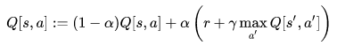

# Apprentissage par renforcement: SNAKE

Ce script reprend le jeu snake avec pygame (source inconnue).
L'objectif est que le serpent apprenne à éviter les murs et s'éviter lui-même tout en mangeant les pommes.
Pour cela, j'ai utilisé le Q-learning.

J'ai réalisé quatre matrices, chacune d'elles correspondent à la direction possible du serpent (haut, bas, droite, gauche).
ces matrices sont mises à jour par la formule:

Avec s l'état en n, s' l'état en n+1, a l'action en n, à l ction en n+1 et r la récompense (le score)
Alpha est le coefficient d'apprentissage.

Cette fonction va venir modifier la valeur de chaque élément des quatre matrices positivement ou négativement en fonction du score qu'elles auront permis d'atteindre.

À chaque tour le serpent va devoir choisir entre les 4 mouvements possibles (haut, bas, droite, gauche) et pour faire son choix il va utiliser l'une de ces matrices mise à jour afin de maximiser le score espéré.
Pour atteindre son objectif il faut aussi prendre en compte qu'il doit se diriger vers les pommes. 

La démarche utilisée est alors en deux étapes.
 - Sélectionner les meilleures possibilités de la matrice associée à la direction en cours.
 - Parmi les solutions restantes le choix se porte sur celle qui minimise l'espace euclidien avec la position de la pomme.
Enfin pour vérifier que le serpent ne se mange pas lui-même je regarde les répercutait du choix et si celui-ci est modifié s'il amène au Game Over